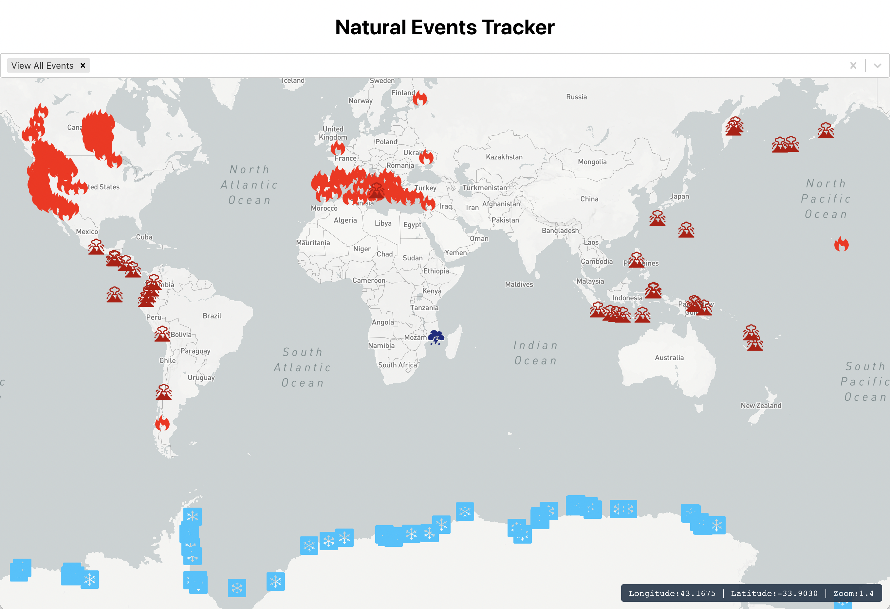

## Natural Events Tracker with react-map-gl & the NASA API (EONET)
live demo [here](https://m9ksy7.csb.app/)

* [Nasa API](https://api.nasa.gov/)
* [React Select](https://react-select.com/home)
* [react-map-gl](https://visgl.github.io/react-map-gl/)

To view the project locally, run `npm start` in the root directory after downloading the repository. Then you'll be able to see it with `localhost:3000` url in the browser.